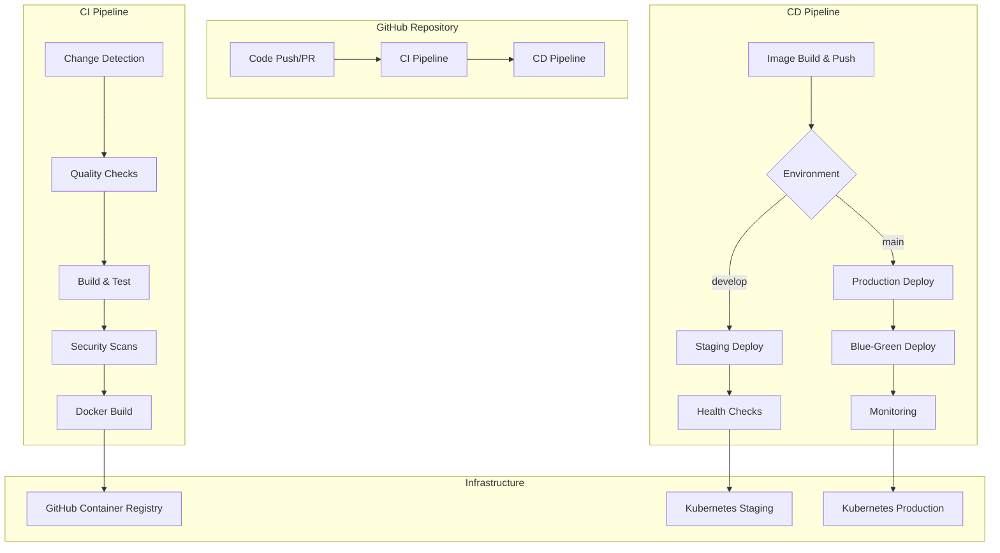

# 🚀 CI/CD Pipeline Documentation

## Overview
This document describes the comprehensive CI/CD pipeline for the Luxury Account platform, built with GitHub Actions, Docker, and Helm for Kubernetes deployment.

## 📋 Pipeline Architecture



## 🏗️ Pipeline Components

### 1. CI Pipeline (.github/workflows/ci.yml)

#### Features:
- **🔍 Smart Change Detection**: Only runs jobs for changed components
- **🎨 Matrix Builds**: Tests across multiple Node.js and Python versions
- **📊 Code Quality**: Linting, formatting, type checking
- **🧪 Comprehensive Testing**: Unit tests with coverage reporting
- **🔒 Security Scanning**: Trivy and Semgrep vulnerability scans
- **🐋 Multi-arch Docker Builds**: AMD64 and ARM64 support
- **⚡ Advanced Caching**: Aggressive caching for fast builds

#### Triggered On:
- Push to `main`, `develop`, feature branches
- Pull requests to `main`, `develop`
- Manual workflow dispatch

#### Jobs:
1. **Change Detection**: Determines which services need building
2. **Frontend Quality**: Next.js linting, testing, building
3. **API Quality**: FastAPI/Python quality checks
4. **Worker Quality**: Python worker service validation
5. **Database Validation**: ClickHouse schema testing
6. **Docker Build**: Multi-platform container builds
7. **Security Scan**: Vulnerability and code analysis

### 2. CD Pipeline (.github/workflows/cd.yml)

#### Features:
- **🎯 Environment-Aware**: Automatic environment detection
- **🐋 Secure Image Management**: GHCR with vulnerability scanning
- **🔄 Blue-Green Deployment**: Zero-downtime production deployments
- **🩺 Health Monitoring**: Comprehensive health checks
- **📊 Deployment Metrics**: Performance and success tracking
- **🔙 Automatic Rollback**: Failure recovery mechanisms
- **✅ Approval Gates**: Production deployment protection

#### Deployment Strategy:
- **Staging**: Direct deployment for rapid iteration
- **Production**: Blue-green deployment with approval gates

## 📦 Helm Chart Structure

```
helm/luxury-account/
├── Chart.yaml                 # Chart metadata
├── values.yaml                # Default configuration
├── values-staging.yaml        # Staging overrides
├── values-production.yaml     # Production overrides
└── templates/
    ├── _helpers.tpl           # Template helpers
    ├── frontend-deployment.yaml
    ├── api-deployment.yaml
    ├── worker-deployment.yaml
    ├── services.yaml
    ├── ingress.yaml
    ├── configmaps.yaml
    ├── secrets.yaml
    └── ...
```

### Key Features:
- **🔧 Environment-Specific Configs**: Separate values for staging/production
- **🔒 Comprehensive Security**: RBAC, security contexts, network policies
- **📈 Auto-scaling**: HPA with CPU/memory metrics
- **💾 Persistent Storage**: Database and file storage
- **🔍 Observability**: Prometheus, Grafana, Jaeger integration
- **🛡️ Production Hardening**: Security best practices

## 🚀 Setup Instructions

### Prerequisites

1. **GitHub Repository Settings**
   ```bash
   # Enable GitHub Actions
   # Configure branch protection rules
   # Set up environments (staging, production)
   ```

2. **Container Registry**
   ```bash
   # GitHub Container Registry is automatically configured
   # Uses GITHUB_TOKEN for authentication
   ```

3. **Kubernetes Clusters**
   ```bash
   # Staging cluster
   # Production cluster
   # Both need ingress controller and cert-manager
   ```

### Required Secrets

#### Repository Secrets:
```bash
# Kubernetes Access
STAGING_KUBECONFIG=<base64-encoded-kubeconfig>
PRODUCTION_KUBECONFIG=<base64-encoded-kubeconfig>

# External Services (optional for enhanced security)
SEMGREP_APP_TOKEN=<semgrep-token>
CODECOV_TOKEN=<codecov-token>
```

#### Environment Secrets (per environment):
```bash
# Database
CLICKHOUSE_PASSWORD=<secure-password>
RABBITMQ_PASSWORD=<secure-password>
MINIO_SECRET_KEY=<secure-key>

# Authentication
NEXTAUTH_SECRET=<64-char-random-string>
GOOGLE_CLIENT_ID=<google-oauth-client-id>
GOOGLE_CLIENT_SECRET=<google-oauth-client-secret>

# Payments
STRIPE_SECRET_KEY=<stripe-secret-key>
STRIPE_PUBLISHABLE_KEY=<stripe-publishable-key>
STRIPE_WEBHOOK_SECRET=<stripe-webhook-secret>
STRIPE_BASIC_PRICE_ID=<price-id>
STRIPE_PRO_PRICE_ID=<price-id>
STRIPE_ENTERPRISE_PRICE_ID=<price-id>

# Security
JWT_SECRET_KEY=<64-char-random-string>
```

### Initial Setup

1. **Configure GitHub Environments**
   ```yaml
   # .github/environments/staging.yml
   name: staging
   protection_rules:
     - type: required_reviewers
       required_reviewer_count: 1
   
   # .github/environments/production.yml
   name: production
   protection_rules:
     - type: required_reviewers
       required_reviewer_count: 2
   ```

2. **Set up Kubernetes Clusters**
   ```bash
   # Install required components
   kubectl apply -f https://raw.githubusercontent.com/kubernetes/ingress-nginx/main/deploy/static/provider/cloud/deploy.yaml
   kubectl apply -f https://github.com/cert-manager/cert-manager/releases/download/v1.13.0/cert-manager.yaml
   
   # Create namespaces
   kubectl create namespace luxury-account-staging
   kubectl create namespace luxury-account-production
   ```

3. **Configure DNS**
   ```bash
   # Point domains to your ingress load balancer
   staging.luxury-account.dev -> <staging-lb-ip>
   luxury-account.com -> <production-lb-ip>
   www.luxury-account.com -> <production-lb-ip>
   ```

## 🎮 Usage Guide

### Development Workflow

1. **Feature Development**
   ```bash
   # Create feature branch
   git checkout -b feature/new-feature
   
   # Make changes
   git add .
   git commit -m "feat: add new feature"
   git push origin feature/new-feature
   
   # CI runs automatically on push
   ```

2. **Pull Request**
   ```bash
   # Create PR to develop
   # CI runs full test suite
   # Deployment to staging happens on merge
   ```

3. **Production Release**
   ```bash
   # Merge develop to main
   git checkout main
   git merge develop
   git tag v1.0.0
   git push origin main --tags
   
   # Production deployment with approval gate
   ```

### Manual Deployment

```bash
# Deploy to staging manually
gh workflow run "🚀 CD Pipeline" \
  --field environment=staging \
  --field version=develop

# Deploy to production manually  
gh workflow run "🚀 CD Pipeline" \
  --field environment=production \
  --field version=v1.0.0
```

### Helm Deployment (Local)

```bash
# Add dependencies
helm dependency update ./helm/luxury-account

# Deploy to staging
helm upgrade --install luxury-account-staging ./helm/luxury-account \
  --namespace luxury-account-staging \
  --values ./helm/luxury-account/values-staging.yaml \
  --set image.tag=develop

# Deploy to production
helm upgrade --install luxury-account-production ./helm/luxury-account \
  --namespace luxury-account-production \
  --values ./helm/luxury-account/values-production.yaml \
  --set image.tag=latest
```

## 🔧 Configuration

### Environment Variables

#### CI/CD Pipeline:
```yaml
NODE_VERSION: '18'
PYTHON_VERSION: '3.12'
REGISTRY: ghcr.io
HELM_VERSION: '3.13.0'
KUBECTL_VERSION: '1.28.0'
```

#### Application Configuration:
```yaml
# Frontend
NODE_ENV: production
NEXTAUTH_URL: https://luxury-account.com

# API  
ENVIRONMENT: production
LOG_LEVEL: INFO
CLICKHOUSE_URL: http://clickhouse:8123

# Worker
WORKER_CONCURRENCY: 4
MAX_RETRIES: 3
```

### Resource Limits

#### Staging:
```yaml
frontend: 500m CPU, 512Mi RAM
api: 1000m CPU, 1Gi RAM  
worker: 2000m CPU, 2Gi RAM
```

#### Production:
```yaml
frontend: 1000m CPU, 1Gi RAM (3-20 replicas)
api: 2000m CPU, 2Gi RAM (5-50 replicas)
worker: 4000m CPU, 4Gi RAM (3-20 replicas)
```

## 📊 Monitoring & Observability

### Metrics Collection
- **Prometheus**: Application and infrastructure metrics
- **Grafana**: Visualization dashboards
- **Jaeger**: Distributed tracing (production only)
- **Loki**: Log aggregation

### Health Checks
- **Liveness Probes**: Application health
- **Readiness Probes**: Traffic readiness
- **Startup Probes**: Initialization monitoring

### Alerting
- **Deployment Failures**: Immediate notification
- **Application Errors**: Error rate thresholds
- **Resource Usage**: CPU/Memory alerts
- **Security Issues**: Vulnerability alerts

## 🛡️ Security Features

### Container Security
- **Non-root containers**: Security hardening
- **Read-only filesystems**: Attack surface reduction
- **Minimal base images**: Reduced vulnerability exposure
- **Regular vulnerability scanning**: Trivy integration

### Kubernetes Security
- **RBAC**: Principle of least privilege
- **Network Policies**: Traffic segmentation
- **Pod Security Standards**: Security contexts
- **Secret Management**: Encrypted secrets

### Code Security
- **SAST**: Static Application Security Testing
- **Dependency Scanning**: Vulnerable dependency detection
- **License Compliance**: OSS license validation
- **Secret Detection**: Credential leak prevention

## 🚨 Troubleshooting

### Common Issues

1. **Build Failures**
   ```bash
   # Check CI logs
   gh run list --workflow="🚀 CI Pipeline"
   gh run view <run-id>
   
   # Local debugging
   npm run lint
   npm run test
   npm run build
   ```

2. **Deployment Failures**
   ```bash
   # Check deployment status
   kubectl get pods -n luxury-account-production
   kubectl describe pod <pod-name>
   kubectl logs <pod-name>
   
   # Check Helm release
   helm status luxury-account-production
   helm rollback luxury-account-production 0
   ```

3. **Health Check Failures**
   ```bash
   # Check service endpoints
   kubectl port-forward svc/luxury-account-frontend 3000:3000
   curl http://localhost:3000/health
   
   # Check ingress
   kubectl get ingress -n luxury-account-production
   nslookup luxury-account.com
   ```

### Recovery Procedures

1. **Rollback Deployment**
   ```bash
   # Automatic rollback via pipeline
   # Or manual rollback
   helm rollback luxury-account-production 0
   ```

2. **Database Recovery**
   ```bash
   # Check ClickHouse status
   kubectl exec -it luxury-account-clickhouse-0 -- clickhouse-client
   
   # Restore from backup
   kubectl apply -f backup-restore-job.yaml
   ```

3. **Emergency Procedures**
   ```bash
   # Scale down services
   kubectl scale deployment luxury-account-frontend --replicas=0
   
   # Drain traffic
   kubectl patch ingress luxury-account-ingress -p '{"spec":{"rules":[]}}'
   ```

## 📈 Performance Tuning

### Build Performance
- **Parallel Jobs**: Matrix builds and concurrent execution
- **Aggressive Caching**: Dependencies, Docker layers, build artifacts
- **Smart Rebuilds**: Only changed components
- **Resource Optimization**: Efficient runner usage

### Runtime Performance
- **Auto-scaling**: HPA based on metrics
- **Resource Limits**: Optimal CPU/memory allocation
- **Distributed Architecture**: Microservices scaling
- **CDN Integration**: Static asset delivery

## 🎯 Best Practices

### Development
- **Feature Branches**: Isolated development
- **Conventional Commits**: Structured commit messages
- **Code Reviews**: Peer review process
- **Automated Testing**: Comprehensive test coverage

### Deployment
- **Environment Parity**: Consistent environments
- **Blue-Green Deployment**: Zero-downtime releases
- **Health Monitoring**: Comprehensive observability
- **Rollback Readiness**: Quick recovery mechanisms

### Security
- **Least Privilege**: Minimal permissions
- **Secret Rotation**: Regular credential updates
- **Security Scanning**: Continuous vulnerability assessment
- **Compliance**: Security best practices

## 📞 Support

### Getting Help
1. **Documentation**: Check this guide and inline comments
2. **Logs**: Review CI/CD logs and application logs  
3. **Issues**: Create GitHub issues for bugs/features
4. **Team**: Contact the DevOps team for urgent issues

### Contacts
- **DevOps Team**: devops@luxury-account.com
- **Security Team**: security@luxury-account.com
- **On-call**: Use PagerDuty for production issues

---

**🎉 Your enterprise-grade CI/CD pipeline is ready for production!**

This pipeline provides:
- ✅ Production-ready deployment automation
- ✅ Security and compliance features
- ✅ Monitoring and observability
- ✅ Scalability and performance optimization
- ✅ Disaster recovery capabilities 